# Street Bowl Café ERD

This is the logical ERD for the database package. A presentation-ready
draw.io version is available in [`ERD.drawio`](ERD.drawio).

## Crow's-foot cardinality legend

| Symbol | Meaning |
|---|---|
| `||` | Exactly one (mandatory) |
| `o|` | Zero or one (optional) |
| `|{` | One or many (mandatory many) |
| `o{` | Zero or many (optional many) |

Read both ends of every relationship. For example,
`SUPPLIERS ||--o{ GOODS_RECEIPTS` means that each goods receipt must reference
exactly one supplier, while one supplier may have zero or many goods receipts.

```mermaid
erDiagram
    AUTH_USERS ||--o| PROFILES : "has profile"
    ROLES ||--o{ PROFILES : assigned
    ROLES ||--o{ ROLE_PERMISSIONS : grants
    PERMISSIONS ||--o{ ROLE_PERMISSIONS : contains

    PROFILES ||--o{ SHIFTS : works
    DEVICES ||--o{ SHIFTS : opened_on
    SHIFTS ||--o{ SHIFT_CASH_MOVEMENTS : contains

    MENU_CATEGORIES ||--o{ MENU_ITEMS : contains
    MENU_ITEMS ||--o{ MENU_VARIANTS : has
    TAX_RATES ||--o{ MENU_VARIANTS : taxed_by

    MODIFIER_GROUPS ||--o{ MODIFIERS : contains
    MENU_ITEMS ||--o{ MENU_ITEM_MODIFIER_GROUPS : allows
    MODIFIER_GROUPS ||--o{ MENU_ITEM_MODIFIER_GROUPS : assigned

    UNITS_OF_MEASURE ||--o{ INVENTORY_ITEMS : base_unit
    INVENTORY_CATEGORIES ||--o{ INVENTORY_ITEMS : contains
    INVENTORY_ITEMS ||--o{ INVENTORY_LOTS : stocked_as
    INVENTORY_ITEMS ||--o{ STOCK_MOVEMENTS : moves
    INVENTORY_LOTS ||--o{ STOCK_MOVEMENTS : lot_trace

    SUPPLIERS ||--o{ SUPPLIER_ITEMS : supplies
    INVENTORY_ITEMS ||--o{ SUPPLIER_ITEMS : sourced_as
    SUPPLIERS ||--o{ PURCHASE_ORDERS : "receives orders"
    PURCHASE_ORDERS ||--o{ PURCHASE_ORDER_ITEMS : contains
    SUPPLIERS ||--o{ GOODS_RECEIPTS : "fulfills receipts"
    PURCHASE_ORDERS o|--o{ GOODS_RECEIPTS : "may be referenced by"
    GOODS_RECEIPTS ||--o{ GOODS_RECEIPT_ITEMS : contains
    PURCHASE_ORDER_ITEMS o|--o{ GOODS_RECEIPT_ITEMS : "may be received as"
    GOODS_RECEIPT_ITEMS o|--o| INVENTORY_LOTS : "may create"
    PROFILES ||--o{ STOCK_OUT_TRANSACTIONS : records
    STOCK_OUT_TRANSACTIONS ||--|{ STOCK_OUT_ITEMS : contains
    INVENTORY_ITEMS ||--o{ STOCK_OUT_ITEMS : releases
    STOCK_OUT_ITEMS ||--|{ STOCK_MOVEMENTS : traces
    SUPPLIERS ||--o{ SUPPLIER_BILLS : bills
    SUPPLIER_BILLS ||--o{ SUPPLIER_BILL_PAYMENTS : paid_by

    PROFILES ||--o{ ORDERS : creates
    SHIFTS ||--o{ ORDERS : handles
    DEVICES ||--o{ ORDERS : entered_on
    ORDERS ||--o{ ORDER_ITEMS : contains
    MENU_VARIANTS ||--o{ ORDER_ITEMS : sold_as
    INVENTORY_ITEMS o|--o{ MENU_VARIANTS : "may fulfill sales of"
    ORDER_ITEMS ||--o{ ORDER_ITEM_MODIFIERS : customized_by
    MODIFIERS ||--o{ ORDER_ITEM_MODIFIERS : selected

    DISCOUNT_TYPES ||--o{ ORDER_DISCOUNTS : type
    ORDERS ||--o{ ORDER_DISCOUNTS : receives

    PAYMENT_METHODS ||--o{ PAYMENTS : method
    ORDERS ||--o{ PAYMENTS : settled_by
    REFUNDS ||--o{ PAYMENTS : refund_payment

    ORDERS ||--o{ REFUNDS : refunded_by
    REFUNDS ||--o{ REFUND_ITEMS : contains
    ORDER_ITEMS ||--o{ REFUND_ITEMS : reverses

    ORDERS ||--o{ ORDER_ACTIONS : audited_by
    ORDERS ||--o{ ORDER_STATUS_HISTORY : status_history

    EXPENSE_CATEGORIES ||--o{ EXPENSES : classifies
    PAYMENT_METHODS ||--o{ EXPENSES : paid_with
    SUPPLIERS ||--o{ EXPENSES : referenced_by

    INVOICE_SEQUENCES ||--o{ SALES_INVOICES : numbers
    ORDERS ||--o| SALES_INVOICES : documented_by
    SALES_INVOICES ||--o{ CREDIT_NOTES : adjusted_by
    REFUNDS ||--o| CREDIT_NOTES : documented_by
    SALES_INVOICES ||--o{ INVOICE_PRINT_EVENTS : printed

    INVENTORY_ITEMS ||--o{ STOCK_COUNT_ITEMS : counted
    STOCK_COUNTS ||--o{ STOCK_COUNT_ITEMS : contains
```



## Relationship verb pairs

Use these forward and reverse verbs when explaining the ERD. They make each
relationship understandable from either entity.

| Entity A | Forward verb | Entity B | Reverse verb |
|---|---|---|---|
| Profile / User | processes | Order | is processed by |
| Order | contains | Order Item | belongs to |
| Order | receives | Payment | settles |
| Order | has | Refund | reverses |
| Menu Variant | is sold as | Order Item | identifies |
| Supplier | fulfills | Goods Receipt | is fulfilled by |
| Goods Receipt | contains | Goods Receipt Item | belongs to |
| Goods Receipt Item | creates | Inventory Lot | is created from |
| Inventory Item | has | Inventory Lot | belongs to |
| Stock-out Transaction | contains | Stock-out Item | belongs to |
| Stock Count | contains | Stock Count Item | belongs to |
| Supplier | is referenced by | Expense | is paid to |

Optional relationships use “may” in the diagram because the related record is
not always required. For example, a direct goods receipt may exist without a
purchase order, and a menu variant may exist without a finished inventory item.

## Core design choices

### No permanent customer table

The café currently does not need customer CRM/loyalty. Customer name, delivery contact, and similar information are stored only as snapshots on the order where required.

### Menu item vs variant

A `menu_item` represents the product family, while `menu_variant` represents the actual sellable option.

Example:

```text
Iced Latte
  ├─ Small
  ├─ Medium
  └─ Large
```

Every sellable item should have at least one variant. Products without visible variants can use a default variant named `Standard`.

### Prepared items and recipes

Prepared-to-order menu items are deliberately untracked at ingredient level.
The system does not require the café to disclose recipes and does not estimate
ingredient consumption from sales. Management controls whether those menu
items are available through their active status.

Only practical countable finished goods may be linked to a menu variant and
deducted automatically when sold.

### Inventory

Every incoming tracked quantity is represented by an inventory lot, even when the item does not expire. Expiration may be null.

One goods receipt can contain many received supplies. One stock-out transaction
can contain many released supplies. Each line stores its entered package unit,
quantity, and conversion to the inventory item's base unit.

Negative consumption uses FEFO where an expiration date exists.

### Purchases vs expenses

Purchases of tracked countable supplies and finished goods are procurement
transactions and are not duplicated as expenses.

Untracked ingredients/grocery purchases and operating costs are recorded in
`expenses`, including date, supplier/grocery, purpose, amount, and receipt or
reference number.

This prevents double-counting ingredient purchases as both an immediate expense and COGS.

### Payments

An order can have multiple payment rows. The first UI version can still allow only one method, but the database is ready for split payment.

### Refunds

Refunds are line-level and can therefore be full or partial. Inventory is not automatically restored on refund because prepared food usually cannot return to sellable stock.

### Invoices

`orders` are operational sales records.

`sales_invoices` are fiscal/document records and preserve business/buyer/tax snapshots even if settings change later.
